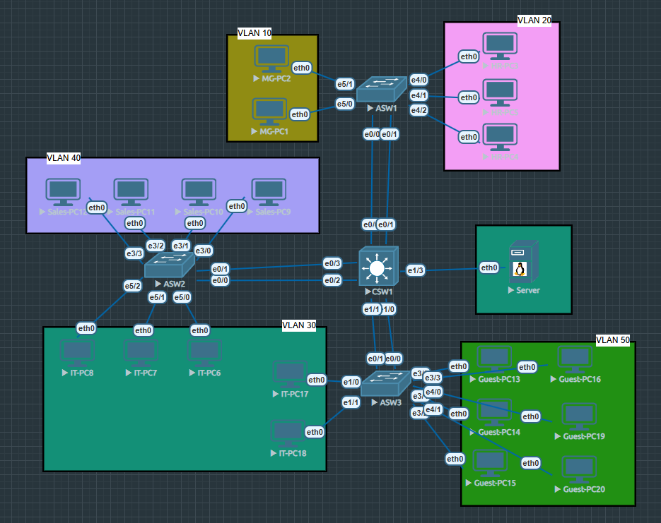

# Lab 1 – Campus Network Segmentation

## Overview

This lab simulates the deployment of a **small enterprise campus network**.  
The goal is to segment departments using VLANs while still allowing communication between them through a multilayer switch.

The lab was built in **EVE-NG** to emulate real Cisco IOS behavior rather than relying purely on simulation.

This was one of my first full topology builds outside of Packet Tracer, so it was also a good exercise in configuring switching infrastructure in a more realistic environment.

---

## Objectives

The main objectives of this lab were:

- Segment network traffic using **VLANs**
- Enable **inter-VLAN routing**
- Configure **trunk links between switches**
- Implement **EtherChannel** for link aggregation
- Deploy **centralized DHCP**
- Apply **port security** on access ports
- Observe **Spanning Tree behavior** in a switched network

---

## Network Topology

The network follows a simple **core-access design**.

Core Layer

- 1 multilayer switch responsible for routing between VLANs

Access Layer

- 3 access switches connecting user devices

End Devices

- 20 PCs
- 1 server

Each access switch represents a different area of the office building.

---

## VLAN Design

| VLAN | Department | Network         | Gateway      |
| ---- | ---------- | --------------- | ------------ |
| 10   | Management | 192.168.10.0/24 | 192.168.10.1 |
| 20   | HR         | 192.168.20.0/24 | 192.168.20.1 |
| 30   | IT         | 192.168.30.0/24 | 192.168.30.1 |
| 40   | Sales      | 192.168.40.0/24 | 192.168.40.1 |
| 50   | Guest      | 192.168.50.0/24 | 192.168.50.1 |

The default gateways for all VLANs are configured on the **multilayer switch**.

---

## Device Layout

Access Switch 1 – Administration

- Management PCs
- HR PCs

Access Switch 2 – Operations

- IT PCs
- Sales PCs

Access Switch 3 – Public Area

- Guest network devices
- Additional IT workstations

The **Server** is located in the IT VLAN.

---

## Key Technologies Implemented

### VLAN Segmentation

Departments were separated into individual VLANs to reduce broadcast domains and improve network organization.

### Inter-VLAN Routing

The multilayer switch provides routing between VLANs so that departments can communicate when necessary.

### Trunk Links

Trunk ports allow multiple VLANs to travel between the core switch and access switches.

### EtherChannel

Two physical uplinks between switches were bundled together to create a single logical link, increasing bandwidth and providing redundancy.

### DHCP

A centralized DHCP server assigns IP addresses to devices across all VLANs.

### Port Security

Access ports were configured to restrict the number of allowed MAC addresses and automatically learn connected devices.

### Spanning Tree

Spanning Tree Protocol prevents switching loops and ensures a stable Layer 2 topology.

---

## Verification

After configuration, the following tests were performed:

- PCs successfully received IP addresses via DHCP
- Devices within the same VLAN could communicate
- Devices in different VLANs could communicate through the multilayer switch
- EtherChannel links formed correctly between switches
- Trunk links carried all required VLANs
- Spanning Tree selected the expected root bridge

Example verification commands used:
